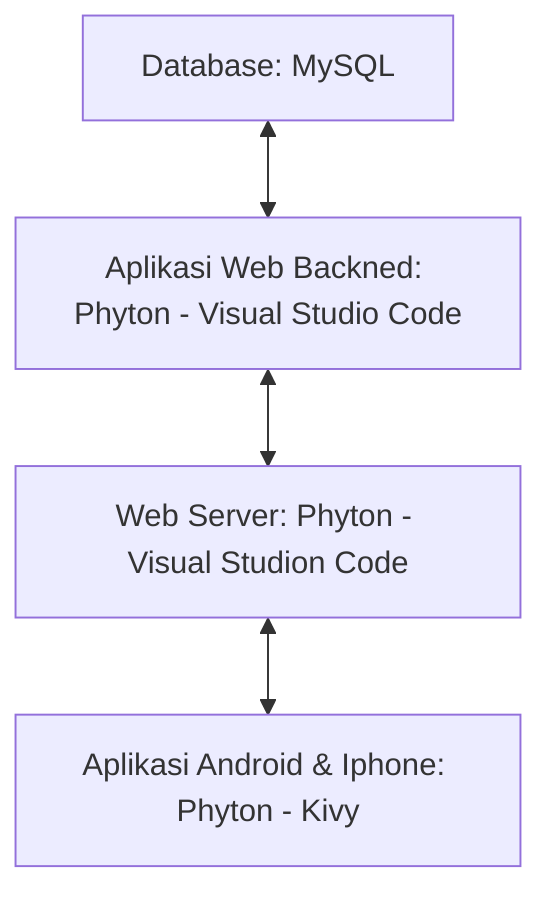

# Aplikasi Asisstent Personal [ Sirr ]
Membuat Aplikasi Sejenis Google Asisstent Dengan Menggunakan Android Studio, Visual Studio Code, MySQL.

## 1.1 Latar Belakang
Aplikasi ini dibuat untuk mempermudah berbagai pekerjaan virtual, membantu menyiapkan kegiatan dan menemani secara virtual. semakin berkembangnya zaman membuat banyak pekerjaan dilakukan secara virtual. maka dari itu aplikasi ini dibuat untuk bisa mengimbangi zaman dan diharapkan dapat membantu dalam mengelola keseharian serta pekerjaan secara virtual layaknya Asisstent Personal.

# Proses pembangunan teknologi informai 
1.	Analysis
2.	Design
3.	Development
4.	Testing
5.	Deployment
6.	Maintenance

## 1.2 Deskripsi Teknologi Informasi
Aplikasi ini bernama "Sir"". Aplikasi ini dibuat untuk membantu dan menemani secara virtual. Aplikasi ini juga dibuat untuk bisa mencari informasi layaknya AI. Terdapat fitur sound Recognition dalam aplikasi ini layaknya memiliki Asisstent Personal.

## 1.3 Analysis: Branding
Merk : Sirr
Tagline : Menemani dan Membantu anda dalam hal tertentu
Campaign : Bagaimana membuat aplikasi yang membuat penggunanya memiliki teman yang bisa menemani dan membantu beberapa pekerjaan secara vitual

# Targer User:
1.	Usia 10+ ( untuk 17 kebawah perlu di damping orang tua ).
2.	Seorang yang sulit bersosialisasi (Introvert).
3.	Sesorang yang memiliki imajinasi yang tinggi.
4.	Seseorang yang ingin memiliki teman yang dapat membantu secara virtual.
5.	Seseorang yang ingin memiliki asisstent pribadi secara virtual.

# User experience 
1.	Mudah
2.	Sederhana
3.	Minimalis
4.	Elegan
5.	Inspirasi Design :

## 2. Analysis: User Story
--- | --- | --- | ---
Sebagai |	Saya ingin bisa |	Sehingga |	Prioritas
Pengguna |	Berbicara |	Bisa memiliki lawan bicara (teman)|	⭐⭐⭐⭐⭐
Pengguna |	Meminta tolong |	Bisa membantu secara virtual |	⭐⭐⭐⭐⭐
Pengguna |	Ditemani |	Bisa merasa memiliki teman	|⭐⭐⭐⭐⭐
Pengguna |	Mencari informasi  |	Bisa mendapat informasi lebih cepat	|⭐⭐⭐⭐
--- | --- | --- | ---

## 3. Analysis: Struktur Data
1.	Pengguna
-	Username
-	Email
-	Password

2.	Sistem
-	Data 

3. Pertanyaan
- Data

4. Jawaban
- Data

## Design: Arsitektur Basis Client-Server
Cloud:

1.	Database: MySQL
2.	Aplikasi Web Backned: Phython – Visual Studio Code
3.	Web Server: Phython – Visual Studio Code
4.	Aplikasi Android dan Iphone: Phython – Qphyton

### Design: User Experience
1. Logo
   
   
